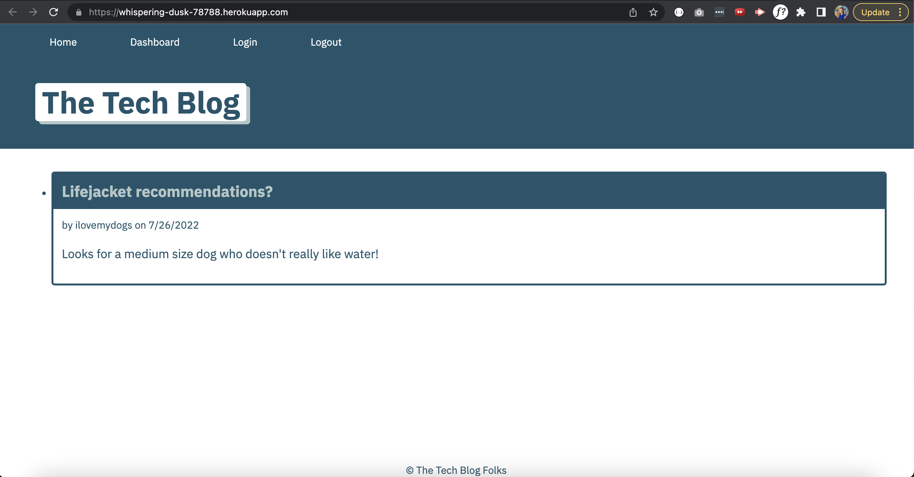

# Tech Blog
<a href="#license"></img></a>

## Description
A CMS-style blog site similar to a Wordpress site, where developers can publish their blog posts and comment on other developers’ posts as well.

### User Story
AS A developer who writes about tech
I WANT a CMS-style blog site
SO THAT I can publish articles, blog posts, and my thoughts and opinions

## Table of Contents
- <a href="#acceptance-criteria">Acceptance Criteria</a>
- <a href="#installation">Installation</a>
- <a href="#usage">Usage</a>
- <a href="#mock-up">Mock-Up</a>
- <a href="#deployed-application">Deployed Application</a>
- <a href="contributors">Contributors</a>
- <a href="#license">License</a>

## Acceptance Criteria
GIVEN a CMS-style blog site

WHEN I visit the site for the first time
THEN I am presented with:
  - homepage, which includes existing blog posts if any have been posted
  - navigation links for the homepage and the dashboard
  - the option to log in

WHEN I click on the homepage option
THEN I am taken to the homepage

WHEN I click on any other links in the navigation
THEN I am prompted to either sign up or sign in

WHEN I choose to sign up
THEN I am prompted to create a username and password

WHEN I click on the sign-up button
THEN my user credentials are saved and I am logged into the site

WHEN I revisit the site at a later time and choose to sign in
THEN I am prompted to enter my username and password

WHEN I am signed in to the site
THEN I see navigation links for the homepage, the dashboard, and the option to log out
W
HEN I click on the homepage option in the navigation
THEN I am taken to the homepage and presented with existing blog posts that include the post title and the date created
W
HEN I click on an existing blog post
THEN I am presented with the post title, contents, post creator’s username, and date created for that post and have the option to leave a comment

WHEN I enter a comment and click on the submit button while signed in
THEN the comment is saved and the post is updated to display the comment, the comment creator’s username, and the date created

WHEN I click on the dashboard option in the navigation
THEN I am taken to the dashboard and presented with any blog posts I have already created and the option to add a new blog post

WHEN I click on the button to add a new blog post
THEN I am prompted to enter both a title and contents for my blog post

WHEN I click on the button to create a new blog post
THEN the title and contents of my post are saved and I am taken back to an updated dashboard with my new blog post

WHEN I click on one of my existing posts in the dashboard
THEN I am able to delete or update my post and taken back to an updated dashboard

WHEN I click on the logout option in the navigation
THEN I am signed out of the site

WHEN I am idle on the site for more than a set time
THEN I am able to view comments but I am prompted to log in again before I can add, update, or delete comments

## Installation
- Clone the directly from the GitHub repository to your local machine.
- Run _npm init_ in the command line.
- Run the command _node server.js_ to launch the application.

### Required Packages
The application's folder structure follows the Model-View-Controller paradigm.

- **express-handlebars** package to use Handlebars.js for the Views
- **MySQL2** and **Sequelize** packages to connect to a MySQL database for the Models
- **Express.js** API for the Controllers
- **dotenv** package to use environment variables
- **bcrypt** package to hash passwords,
- **express-session** and connect-session-sequelize packages to add authentication.

## Usage
To access a community of tech professionals who share blog posts of new information or technologies and commentary on the blogs.

## Mock-Up

## Deployed Application
Live url: https://whispering-dusk-78788.herokuapp.com/ 
Repo url: https://github.com/cpm-128/tech-blog

### Screencapture

## Contributors
Some bonus starter code provided by UNC Chapel Hill Bootcamp.
## License
MIT License

Copyright (c) [2022] [Colleen Maher]

Permission is hereby granted, free of charge, to any person obtaining a copy
of this software and associated documentation files (the "Software"), to deal
in the Software without restriction, including without limitation the rights
to use, copy, modify, merge, publish, distribute, sublicense, and/or sell
copies of the Software, and to permit persons to whom the Software is
furnished to do so, subject to the following conditions:

The above copyright notice and this permission notice shall be included in all
copies or substantial portions of the Software.